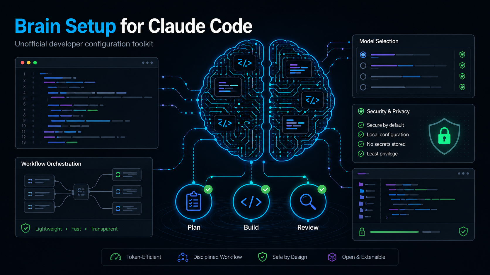

# Claude Brain Setup

> **Unofficial Claude Code configuration toolkit. Not affiliated with Anthropic.**

A practical, installable configuration for Claude Code that makes it work in a disciplined, token-efficient way — with an optional interactive setup that personalizes it to your workflow.

## What This Is

A `CLAUDE.md` system-instruction file plus supporting docs, scripts, and examples. Install it and Claude Code gets consistent, explicit rules: when to plan, which model to pick, how to use skills, when to hand off sessions.

## What This Does NOT Do

- **Does not auto-switch models.** Claude cannot change models mid-session. You pick the model at launch with `--model`. This project helps you pick correctly.
- **Does not reduce tokens automatically.** Good habits reduce tokens. This project gives you those habits in writing.
- **Does not make `/dream` edit your CLAUDE.md automatically.** The dream skill is a manual memory-consolidation tool you run deliberately.
- **Does not know your exact context window percentage.** Claude estimates remaining space; it has no precise percentage counter.
- **Does not require root or admin rights.** Everything installs to your home directory.

## Quick Start (3 commands)

```bash
git clone https://github.com/JanniEinfach/claude-brain-setup.git
cd claude-brain-setup
./scripts/install.sh
```

Then launch Claude Code:

```bash
claude --model claude-sonnet-4-6
```

## Install Options

### Linux / macOS — Quick install (defaults)

Copies the default `CLAUDE.md` to your home directory. Backs up any existing file before writing.

```bash
chmod +x scripts/install.sh
./scripts/install.sh
```

### Linux / macOS — Guided interactive setup (recommended)

Asks 15 questions and generates a personalized `CLAUDE.md` tailored to your name, language, work type, tech stacks, and preferences.

```bash
chmod +x scripts/setup.sh
./scripts/setup.sh
```

Additional flags:

```bash
./scripts/setup.sh --dry-run            # Preview output without writing any files
./scripts/setup.sh --target ~/mydir     # Install to a custom directory
```

### Windows PowerShell — Quick install

```powershell
.\scripts\install.ps1
```

Additional options:

```powershell
.\scripts\install.ps1 -DryRun             # Preview without writing
.\scripts\install.ps1 -Target C:\Users\You\claude-config   # Custom directory
```

### Windows PowerShell — Guided interactive setup

```powershell
.\scripts\setup.ps1
```

Additional options:

```powershell
.\scripts\setup.ps1 -DryRun
.\scripts\setup.ps1 -Target C:\Users\You\claude-config
```

No admin rights required on any platform.

## Interactive Setup Flow

Running `setup.sh` walks you through 15 questions covering: your name, preferred response language, main work type (web, backend, FiveM, DevOps, etc.), model strategy, token-saving strictness, planning preference, code style, testing preference, security level, primary tech stacks, frontend style, marketing support, FiveM guidance, memory/dream usage, and agent orchestration level.

It fills a `CLAUDE.md` template with your answers, optionally appending a FiveM section or a marketing section. Before writing, it backs up any existing file with a timestamp suffix so nothing is lost.

Full question guide with explanations: `docs/ONBOARDING_QUESTIONS.md`

## Example Workflows

**Standard development session:**

```bash
claude --model claude-sonnet-4-6
# Inside the session:
# /plan-agent    — write a plan before touching 3+ files
# /tdd           — test-first workflow
# /review        — quality check before committing
# /create_handoff — save context before ending a large session
```

**Quick edit or formatting:**

```bash
claude --model claude-haiku-4-5-20251001
# Single-file changes, renaming, simple fixes
```

**Architecture or security review:**

```bash
claude --model claude-opus-4-7
# Complex multi-file work, auth systems, database schema changes
```

**Session got too large:**

```
/create_handoff   # Claude writes a context summary
# End the session
# Start a new session with the right model, paste the handoff
```

## Bundled Brain Skills

This repository includes 13 ready-to-use Brain skills that install directly to `~/.claude/skills/`. They are portable Markdown instruction files — no code executes automatically. Claude Code reads them as context when you load a skill with `/skill-name` during a session.

| Skill | Purpose |
|-------|---------|
| `brain-core-workflow` | Disciplined six-step development workflow |
| `brain-token-discipline` | Habits that reduce token usage without losing quality |
| `brain-model-routing` | Choosing the right model before a session starts |
| `brain-karpathy-principles` | Engineering discipline: think before coding, simplicity, surgical changes |
| `brain-security-review` | Security checklist for code and repositories |
| `brain-cross-platform-setup` | Validate scripts work on Linux, macOS, and Windows |
| `brain-session-handoff` | Structured handoff before ending a large session or switching models |
| `brain-pr-review` | PR review checklist for this repository |
| `brain-ruflo-orchestration` | When and how to use multi-agent workflows |
| `brain-skill-authoring` | Guide for writing new bundled Brain skills |
| `brain-github-release` | Checklist for preparing a public GitHub release |
| `brain-marketing-support` | Writing guidance for sales, marketing, and SEO copy (optional) |
| `brain-fivem-development` | FiveM Lua scripting, NUI, and framework guidance (optional) |

Install bundled skills on **Linux / macOS**:

```bash
./scripts/install.sh --with-skills
# or during interactive setup:
./scripts/setup.sh
```

Install bundled skills on **Windows PowerShell**:

```powershell
.\scripts\install.ps1 -WithSkills
# or during interactive setup:
.\scripts\setup.ps1
```

The interactive setup script (`setup.sh` / `setup.ps1`) will ask whether to install bundled skills as part of its standard flow. You can always install them separately later with `--with-skills` / `-WithSkills`.

## Security Notes

- The install script never deletes files. It only copies and backs up.
- No secrets, API keys, or tokens belong in `CLAUDE.md` or `settings.json`.
- `settings.example.json` contains read-only shell permissions by default. Review before using.
- Bundled skills are Markdown files only. They do not run code automatically.
- See `docs/SECURITY.md` for the full security guide.

## File Structure

```
claude-brain-setup/
├── README.md
├── CLAUDE.md                     — default system instruction file
├── CHANGELOG.md
├── CONTRIBUTING.md
├── CODE_OF_CONDUCT.md
├── LICENSE
├── settings.example.json         — safe example Claude Code settings
├── .gitignore
├── templates/
│   └── CLAUDE.template.md        — template used by setup.sh / setup.ps1
├── scripts/
│   ├── install.sh                — quick non-interactive installer (Linux/macOS)
│   ├── setup.sh                  — interactive personalized setup (Linux/macOS)
│   ├── install.ps1               — quick non-interactive installer (Windows)
│   └── setup.ps1                 — interactive personalized setup (Windows)
├── skills/                       — bundled Brain skills (13 included)
│   ├── brain-core-workflow/
│   ├── brain-token-discipline/
│   ├── brain-model-routing/
│   ├── brain-karpathy-principles/
│   ├── brain-security-review/
│   ├── brain-cross-platform-setup/
│   ├── brain-session-handoff/
│   ├── brain-pr-review/
│   ├── brain-ruflo-orchestration/
│   ├── brain-skill-authoring/
│   ├── brain-github-release/
│   ├── brain-marketing-support/
│   └── brain-fivem-development/
└── docs/
    ├── ONBOARDING_QUESTIONS.md   — all 15 setup questions explained
    ├── MODEL_ROUTING.md          — how to pick the right model
    ├── TOKEN_EFFICIENCY.md       — practical token-saving habits
    ├── SKILLS.md                 — verified skill list with token costs
    ├── RUFLO_ORCHESTRATION.md    — when and how to use agents
    ├── SECURITY.md               — what this project touches and risks
    ├── TROUBLESHOOTING.md        — common issues and fixes
    ├── FAQ.md                    — short answers to common questions
    └── PRINCIPLES.md             — engineering principles (think before coding)
```

## Requirements

- Claude Code installed (`npm install -g @anthropic-ai/claude-code`)
- An Anthropic API key or Claude Pro/Max subscription
- Bash shell (macOS or Linux) or PowerShell 5.1+ (Windows)
- No root or admin rights required

## Troubleshooting

See `docs/TROUBLESHOOTING.md` for common issues and fixes.

## Security Notes

The install scripts never delete user files. Existing `CLAUDE.md` files are backed up with a timestamp before any overwrite. See `docs/SECURITY.md` for the full guide.

Do not put secrets, API keys, or private paths in `CLAUDE.md`. It is read as a system prompt, not a config file.

## Contributing

See [CONTRIBUTING.md](CONTRIBUTING.md) for how to fork, validate, and submit pull requests. Contributions must pass all syntax and security checks before submission.

## License

MIT — see `LICENSE`.
